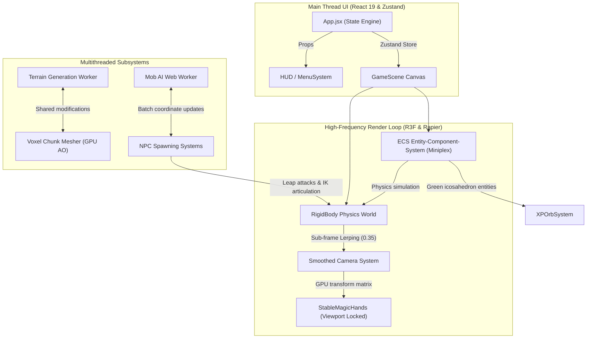

# 🎮 Crafty — Next-Gen 3D Browser Voxel Engine

<div align="center">

[](https://react.dev)
[](https://threejs.org)
[](https://rapier.rs)
[](https://github.com/hmans/miniplex)
[](https://vite.dev)

A buttery-smooth, high-craft 3D voxel sandbox and magic RPG engine running entirely in the browser. Powered by a modern declarative-imperative hybrid architecture to deliver immersive performance at 120Hz/ProMotion refresh rates.

[Live Demo](http://localhost:3000) • [Architecture](#-architecture) • [Keybindings](#-controls) • [Quick Start](#-quick-start)

</div>

---

## ✨ Features

* **⚡ Zero-Stutter Performance**: High-frequency gameplay calculations (mob movement, spatial tracking, particles) are fully decoupled from React's state tree, utilising direct object pools and offscreen **Web Workers** to maintain a flawless 60/120 FPS.
* **🌀 Dynamic Voxel World**: Noise-based moisture and temperature map generating distinct biomes (Forest, Desert, Snowy Mountains) with real-time vertex-based **Ambient Occlusion** cave networks.
* **🧙 Enhanced Magic & Combat**: Interactive spell-casting pipeline supporting fireball projectiles, spatial grid-optimized chain lightning, and zombie AI mobs with inverse-kinematics leg articulation and leap attacks.
* **💚 Physical ECS XP Orbs**: Dynamic `miniplex` ECS-driven emerald XP orbs with explosive scatter physics, physical ground bounces, and high-fidelity quadratic magnetic pull to the player.
* **🛒 Passive Villagers & Trading**: Interactive passive merchant mobs featuring rich glassmorphic reciprocal trading panels and procedural audio chimes.
* **💾 Offline World Save & Sync**: Complete world chunk modification saving, guest-friendly inventory preservation, and local storage restoration bypassing authentication walls.

---

## 🛠️ Architecture

Crafty is engineered on a modern **Hybrid ECS & Multi-Worker Architecture** that bridges React's declarative syntax with Three.js/WebGL's high-frequency imperative performance.



### Technical Design Pillars
1. **GPU-Bound Viewport Locking**: The player's first-person hands are mounted natively within the active three.js camera primitive hierarchy. Complex global coordinate translations and wobbly lerps are replaced with local matrix locking, assuring 100% vibration-free hand meshes during high-momentum jumps.
2. **Sub-Frame Interpolation**: To prevent 60Hz physics step stutter on high-refresh ProMotion (120Hz) screens, camera updates are mathematically lerped toward the player's translation by a decay factor of `0.35`, keeping input lag imperceptible while absorbing micro-snaps.
3. **Seam-Resistant Grounding**: Ground detection uses a downward Rapier physical raycast (`world.castRay`) extending 1.05 units from the capsule center, ensuring rock-solid jumping mechanics across flat voxel triangle seams.

---

## ⌨️ Controls

| Key | Action |
| :--- | :--- |
| **`W` `A` `S` `D`** | Walk & Strafe |
| **`Space`** | Jump |
| **`Mouse`** | Look around |
| **`Left Click`** | Mine Block / Attack Mob |
| **`Right Click`** | Place Block |
| **`Scroll Wheel`** | Cycle Hotbar blocks |
| **`1` - `4`** | Select Magic Spell (Fireball, Frost, Lightning, Build) |
| **`F`** | Cast Selected Spell |
| **`E`** | Open Inventory UI |
| **`C`** | Open Crafting Grid (3x3 grid matching) |
| **`M`** | Open Magic Panel |
| **`B`** | Open Building Tools |
| **`G`** | Proximity Interact (Trading with Villager / Opening Loot Chest) |
| **`ESC`** | Game Settings Menu |

---

## 🚀 Quick Start

### Prerequisites
* [Node.js](https://nodejs.org/) (v18+ recommended)
* `npm` or `pnpm`

### Installation
1. Clone the repository:
   ```bash
   git clone https://github.com/wowlegend/Crafty.git
   cd Crafty
   ```
2. Setup and run the frontend development server:
   ```bash
   cd frontend
   npm install
   npm run dev
   ```
3. Open your browser and navigate to **[http://localhost:3000](http://localhost:3000)**.

---

## 🧠 Memory & Documentation

This codebase adheres to a structured **4-Piece Agentic Memory Architecture** located inside the `/memory` directory to sustain documentation integrity across developer handoffs:
* 🗺️ **[ROADMAP.md](memory/ROADMAP.md)**: Prioritized directory of future features, combat dynamics, and biome generation.
* 🏛️ **[ARCHITECTURE.md](memory/ARCHITECTURE.md)**: Structural laws, performance boundaries, and component maps.
* 📜 **[CHANGELOG.md](memory/CHANGELOG.md)**: Reverse-chronological logging of feature integrations and cleanups.
* 📝 **[ACTIVE_PLAN.md](memory/ACTIVE_PLAN.md)**: Real-time checkpoint tracking of in-flight tasks.
