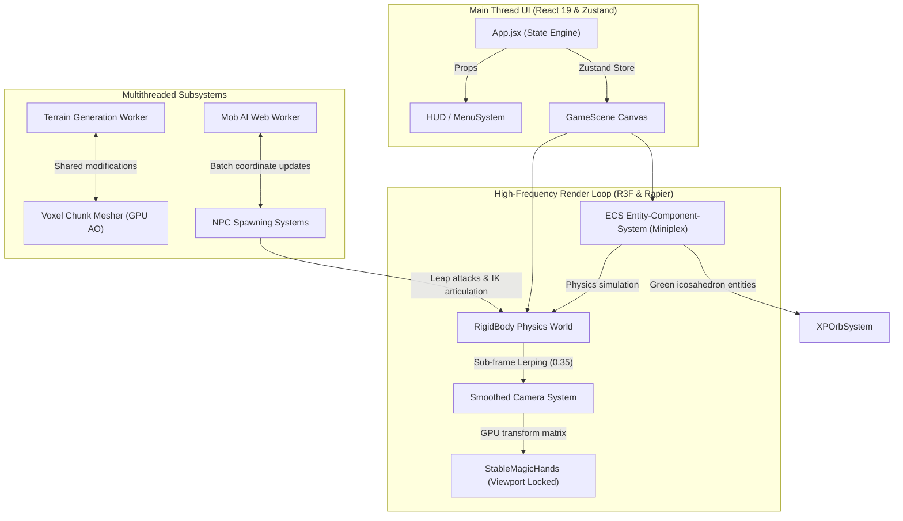

# 🎮 Crafty — Next-Gen 3D Browser Voxel Engine

<div align="center">

[](https://github.com/wowlegend/Crafty/actions/workflows/ci.yml)

[](https://react.dev)
[](https://threejs.org)
[](https://rapier.rs)
[](https://r3f.docs.pmnd.rs)
[](https://vite.dev)

<sub>Version badges read <code>frontend/package.json</code> directly — they cannot go stale, which the hand-typed ones they replaced had already managed.</sub>

A high-craft 3D voxel action-RPG that runs entirely in the browser — explore a procedurally generated frontier of distinct biomes, wield four combat Aspects and an elemental spell arsenal, and chase the Blight-Heart climax. Built on a declarative-imperative hybrid (React + R3F/Three.js + Rapier) tuned for high-refresh (ProMotion 120Hz) smoothness, and playable on desktop, iPad, and iPhone.

[▶ Play the Live Demo](https://crafty-sand.vercel.app) • [Architecture](#-architecture) • [Controls](#-controls) • [Quick Start](#-quick-start)

</div>

---

## ✨ Features

* **🗡️ Four combat Aspects**: WILDHEART (beast-form transformation with per-form movement + melee), VOIDHAND (telekinetic grab/hurl), SOULBIND (convert enemies into allies), and ELEMANCER (elemental spell mastery) — each with its own verbs, VFX, and audio motif.
* **🔥 Distinct elemental spells**: fire, ice, lightning, and arcane, each a genuinely distinct silhouette + motion + palette — a roiling flame teardrop, a solid faceted ice crystal, a thin crackling lightning wire, and an orbital arcane rune-wheel — with per-cast telegraphs and impacts.
* **🌍 Procedural frontier world**: noise-driven temperature × moisture × continent selection across 10 biomes (snow, taiga, plains, forest, meadow, swamp, jungle, savanna, desert, mesa) with per-biome flora, vertex ambient occlusion, a toon ocean + shore foam, a dynamic day/night cycle, and biome-aware weather (rain/snow).
* **⚡ Decoupled high-frequency loop**: mob AI, spatial tracking, particles, and terrain meshing run off React's state tree via transient refs, object pools, and offscreen **Web Workers** (A* pathfinding + greedy-mesher chunk generation) to keep the render loop smooth on the web/mobile envelope.
* **👾 ECS mobs, loot & XP**: a `miniplex` ECS drives mobs, physical loot drops, and magnetic emerald XP orbs; a Shadow-Dragon boss anchors a real win-state at the frontier's Blight-Heart lair.
* **🛒 Trading, crafting & progression**: passive merchant villagers with reciprocal trading, a 3×3 crafting grid, an attribute/talent progression tree, and a spell-mastery upgrade system.
* **📱 Desktop + touch**: full desktop mouse-look/keyboard plus a built-out iPad/iPhone touch layer (virtual joystick, verb wheel, pointer-lock-free cold start).
* **🎨 One bold-flat UI**: a single token-driven design language (filled 2-tone game-icons for content, outline icons for chrome), an English/简体中文 locale toggle, and the test harness below guarding every pixel of it.
* **💾 Offline world save**: chunk modifications, inventory, and progression persist to local storage — no login wall.

---

## 🛠️ Architecture

Crafty is engineered on a modern **Hybrid ECS & Multi-Worker Architecture** that bridges React's declarative syntax with Three.js/WebGL's high-frequency imperative performance.


```mermaid
graph TD
    subgraph "Main Thread UI (React 19 & Zustand)"
        A["App.jsx (State Engine)"] -->|"Props"| B["HUD / MenuSystem"]
        A -->|"Zustand Store"| C["GameScene Canvas"]
    end

    subgraph "High-Frequency Render Loop (R3F & Rapier)"
        C --> D["RigidBody Physics World"]
        C --> E["ECS Entity-Component-System (Miniplex)"]
        D -->|"Sub-frame Lerping (0.35)"| F["Smoothed Camera System"]
        F -->|"GPU transform matrix"| G["StableMagicHands (Viewport Locked)"]
    end

    subgraph "Multithreaded Subsystems"
        H["Terrain Generation Worker"] <-->|"Shared modifications"| I["Voxel Chunk Mesher (GPU AO)"]
        J["Mob AI Web Worker"] <-->|"Batch coordinate updates"| K["NPC Spawning Systems"]
    end

    E -->|"Physics simulation"| D
    E -->|"Green icosahedron entities"| L["XPOrbSystem"]
    K -->|"Leap attacks & IK articulation"| D
```

### Technical Design Pillars
1. **GPU-Bound Viewport Locking**: The player's first-person hands are mounted natively within the active three.js camera primitive hierarchy. Complex global coordinate translations and wobbly lerps are replaced with local matrix locking, assuring 100% vibration-free hand meshes during high-momentum jumps.
2. **Sub-Frame Interpolation**: To prevent 60Hz physics step stutter on high-refresh ProMotion (120Hz) screens, camera updates are mathematically lerped toward the player's translation by a decay factor of `0.35`, keeping input lag imperceptible while absorbing micro-snaps.
3. **Seam-Resistant Grounding**: Ground detection uses a downward Rapier physical raycast (`world.castRay`) extending 1.05 units from the capsule center, ensuring rock-solid jumping mechanics across flat voxel triangle seams.

---

## 🔬 The test harness — the unusual part

Most of this repo's engineering effort is not in the game. It is in making the game's own instruments
incapable of lying, after several of them were caught doing exactly that.

| Gate | What it stops |
| :--- | :--- |
| **31-frame visual regression** | Deterministic headless captures diffed against committed PNG oracles. A **per-frame local-density ratchet** runs beside the global 6% tolerance, because a 248×248 block of a frame can change completely while moving only 0.02% of the pixels — the false negative the global gate cannot see. |
| **`Mutation-Proof:` trailer** | A commit adding or rewriting a gate must state what was broken to make it go RED. A gate green on day one against unfixed code is a rubber stamp. |
| **`Baseline-Review:` trailer** | The visual oracle has its own governance: a baseline rewrite is its own commit, never bundled with `src/`. Measured over 1,603 commits, ten of the last twelve baseline rewrites were bundled — which is how four monster baselines quietly became pictures of an empty mountain. |
| **`gate-shape`** | Assertions satisfiable by a *comment*, plus a frozen source-grep population that may fall and never rise. |
| **`doc-currency`** | Canonical docs citing paths that no longer exist — including bare, un-backticked ones. |
| **`cli-guard`** | A script exporting a seam while running its CLI at module scope, so importing it executes the tool. |
| **`bundle-budget`** | Per-chunk byte ceilings, with `three` / `rapier` / `r3f` split out. |

Plus `eslint` (where `no-unused-vars` is an **error**), the full unit suite, a production build, `knip`,
and a 3-way-sharded Playwright e2e run in CI.

**Counts are deliberately not written here.** This file said *"24-state visual-regression gate + ~1,970
unit tests"* while the real figures were 31 and 3,189 — a number in prose rots no matter how confidently
it was written. Read them from the source instead:

```bash
cd frontend
ls tests/visual/baseline/*.png | wc -l   # gated frames
npm run test:unit                        # the suite prints its own total
```

---

## ⌨️ Controls

| Key | Action |
| :--- | :--- |
| **`W` `A` `S` `D`** | Walk & Strafe |
| **`Space`** | Jump |
| **`Mouse`** | Look around |
| **`F`** | **Cast** selected spell (magic is the marquee verb) |
| **`T`** | **Melee** attack |
| **`Left Click`** | Mine block / melee |
| **`Right Click`** | Cast selected spell / place block |
| **`Scroll Wheel`** | Cycle hotbar blocks |
| **`1` - `4`** | Select spell (Fireball, Iceball, Lightning, Arcane) |
| **`E`** | Open Inventory |
| **`C`** | Open Crafting Grid (3×3) |
| **`M`** | Open Magic / Spell panel |
| **`B`** | Open Building tools |
| **`G`** | Interact (trade with villager / open loot chest) |
| **`ESC`** | Settings menu |

_On touch (iPad/iPhone): a virtual joystick + an on-screen verb wheel replace the keyboard/mouse verbs._

---

## 🚀 Quick Start

### Prerequisites
* **[Node.js](https://nodejs.org/) 24.x** — not a suggestion: `frontend/package.json` declares
  `"engines": { "node": ">=24.0.0 <25" }` and install fails outside that range. (This line said "v18+
  recommended" until 2026-08-13, which was wrong in the one direction that matters — it sent newcomers
  at a version the project rejects.)
* **npm** — the repo is locked with `package-lock.json`; pnpm/yarn will resolve a different tree.

### Installation
1. Clone the repository:
   ```bash
   git clone https://github.com/wowlegend/Crafty.git
   cd Crafty
   ```
2. Setup and run the frontend development server:
   ```bash
   cd frontend
   npm install
   npm run dev
   ```
3. Open your browser and navigate to **[http://localhost:3000](http://localhost:3000)** — set explicitly by
   `server.port` in `frontend/vite.config.js`, which also sets `open: true`, so it launches on its own.


---

## 🧠 Memory & Documentation

This codebase adheres to a structured **4-Piece Agentic Memory Architecture** located inside the `/memory` directory to sustain documentation integrity across developer handoffs:
* 🗺️ **[ROADMAP.md](memory/ROADMAP.md)**: Prioritized directory of future features, combat dynamics, and biome generation.
* 🏛️ **[ARCHITECTURE.md](memory/ARCHITECTURE.md)**: Structural laws, performance boundaries, and component maps.
* 📜 **[CHANGELOG.md](memory/CHANGELOG.md)**: Reverse-chronological logging of feature integrations and cleanups.
* 📝 **[ACTIVE_PLAN.md](memory/ACTIVE_PLAN.md)**: Real-time checkpoint tracking of in-flight tasks.
